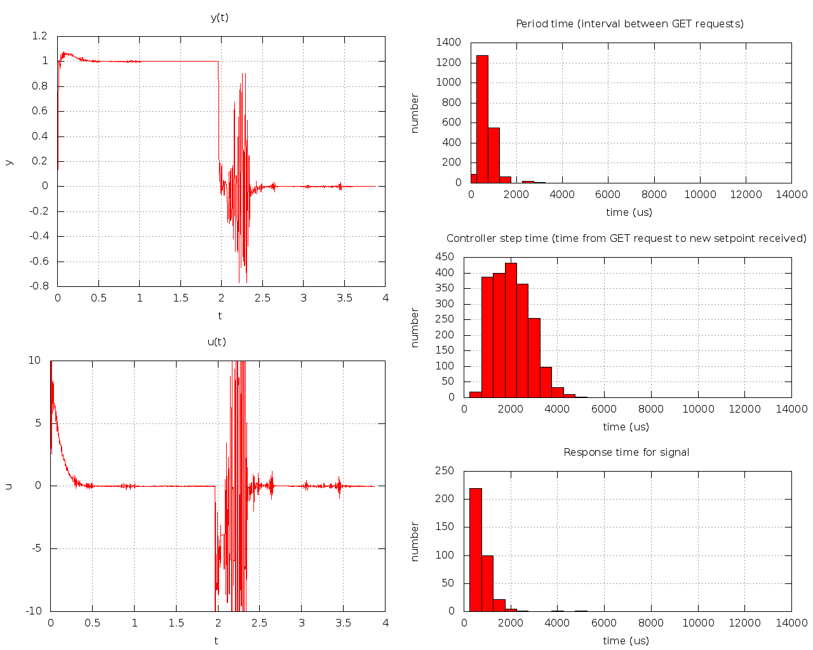
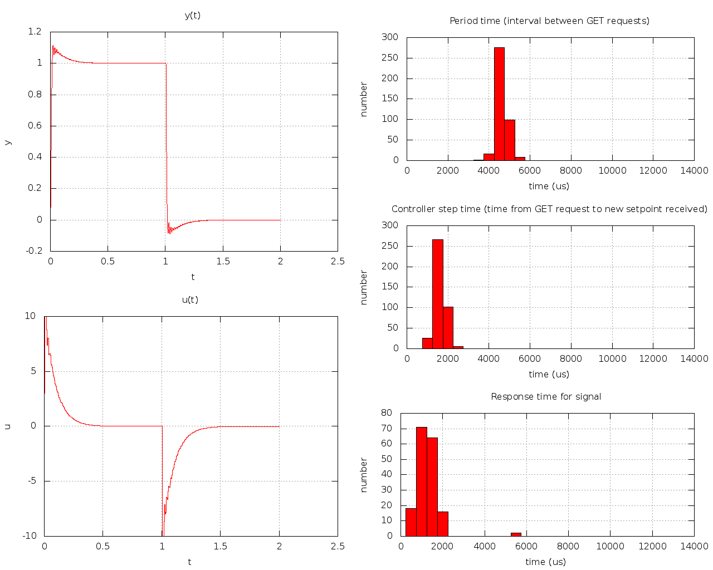

# Miniproject - TTK4147 Real-Time Systems
This folder contains source code, external libraries - as well as a Makefile for compiling.

## Project structure
* `./Makefile` - The recipe for how to build the code into an executable
* `./src/...` - The code we have written ourselves
* `./lib/...` - The external libraries we were supplied

Note that in order for the Makefile to work, the location of the executable `avr32-linux-gcc` must be in your `PATH` environment variable.

## Design decisions
### Threads
We decided to use two pthreads, in addition to the parent thread. The two threads never interract directly with each other.
(Only indirectly). They are both found inside of the communication module.

* `receiver_thread`
  - Pick up `GET_ACK` messages (receiving the y-values).
  - Pick up and reply to `SIGNAL`-messages with `SIGNAL_ACK`.
* `requester_thread`
  - Periodically send `GET` messages to the server.
  
The main function loop then simply waits for the next y-value, 
supplies the reference error to the controller before sending the actuation u back to the server.

### Controller
A PID controller was chosen, with the suggested controller parameters. (Kp = 20, Ki = 1000, Kd = 0.01). You can find these constants (among with other constants) in `./src/config.h`. 

A constant period was assumed by the controller, in spite of the period not actually being constant in practice. This might cause the system to be a bit harder to stabilize.

### Choice of period
Some different periods were tested, all from 1 ms to 10 ms. At first, this was entirely experimental - to see how fast/efficient the system really were. But based on the results, it seemed that 2 ms provided the best results among the periods that were tested.

### Miscellaneous
One thing to note about all the plots, is that the mean measured period time is less than the specified period. This makes no sense whatsoever, since we know that it takes 2 seconds overall to run, and the numer of iterations is exactly 1000 (for a period of 2 ms). The mean should clearly then be 2 / 1000 = 2 ms.

## Results [plot5]
#### Period: 1 ms
Notice how the controller is not able to keep up with everything it needs to do here. The SET-responses are delayed by several periods, and the observed state is chaotic (although it still manages to reach the reference somehow). Perhaps the most clear sign, is that in order to run everything, it uses almost twice as much time as is available. Maybe this is a hint that twice the period will be close to perfect.

#### Period: 2 ms
Notice how everything just works for a period of 2 ms. This is likely rather close to the minimum period - and is in that sense optimal.

#### Period: 3 ms
Slightly slower and with more overswing than when using a period of 2 ms.

#### Period: 5 ms
An even more pronounced overswing than 3 ms, and the reference takes more time to reach.

#### Period: 10 ms
This is chaotic, and the controller is in no way able to reach the reference.

## Results [plot4]
#### Period: 2 ms

