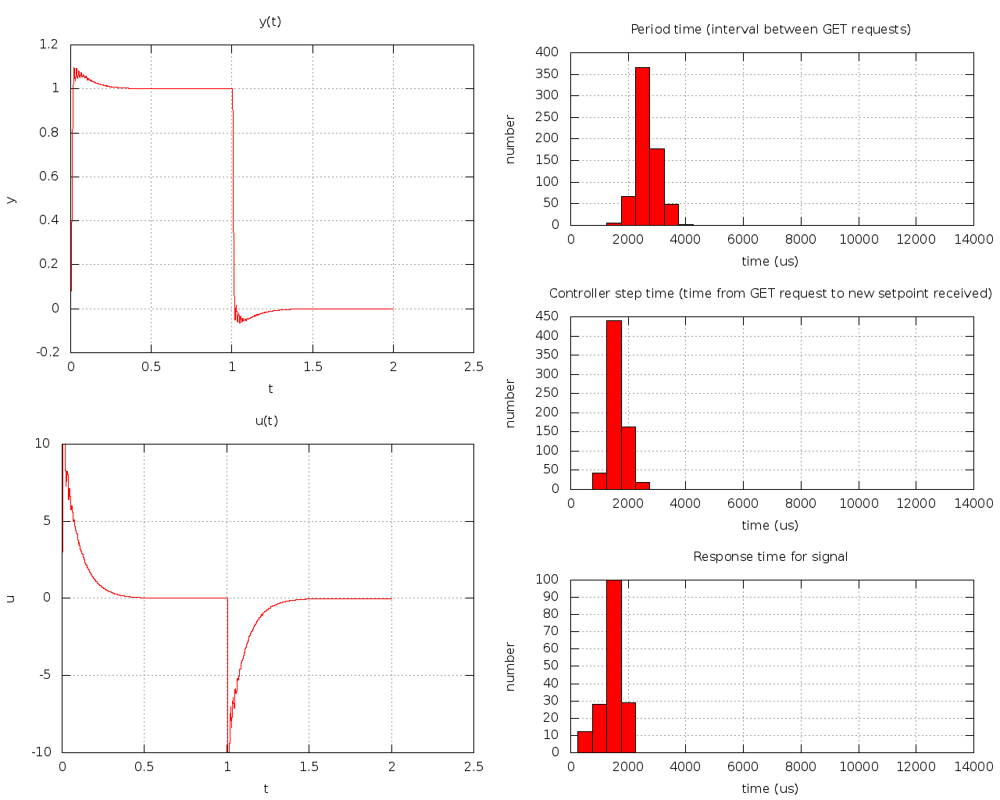

# Miniproject - TTK4147 Real-Time Systems
This folder contains source code, external libraries - as well as a Makefile for compiling.

## Project structure
* `./Makefile` - The recipe for how to build the code into an executable
* `./src/...` - The code we have written ourselves
* `./lib/...` - The external libraries we were supplied
* `./results/...` - The plots generated by the server

Note that in order for the Makefile to work, the location of the executable `avr32-linux-gcc` must be in your `PATH` environment variable.

## Design decisions
### Threads
It is preferable that the threads have as seperate responsibilities as possible. This is because the code/thread functions will be easier to reason about, and it will be harder to make mistakes related to concurrency.

There is in fact one potential race condition to be aware of, as a user of the communication module: `communication_init()` must be run before all the other exported functions. Failing to do this will cause a deadlock when running `communication_await_y()`.

We decided to use two pthreads within the communication module, because it would allow for very high-level abstractions of the interface. This allows the main thread to have a minimal responsibility, being the intersection between the communication module and the controller module.

* Parent thread (main function)
  - Load/initialize communication and controller modules
  - Receive y-values (communication), compute control-signal (controller), and send this back (communication)
  - Will run for (2000 / PERIOD_MS) iterations, before shutting down communication/controller and exiting.
* `receiver_thread`
  - Pick up `GET_ACK` messages (receiving the y-values).
  - Pick up and reply to `SIGNAL`-messages with `SIGNAL_ACK`.
  - The reason for making the receiver thread was more so to provide a high-level-abstraction to the receiving of y-values. This thread also response to SIGNAL-messages with aknowledgements.
* `requester_thread`
  - Periodically send `GET` messages to the server.
  - The reason for making the requester_thread, is that it is a way of "guaranteeing" that messages are sent with a period that on average is equal to the defined one.
  
IO is generally slow, especially over a network, which is why these tasks should not block others from using the CPU. This is a big resason to give them their own threads.

### Controller
A PID controller was chosen, with the suggested controller parameters. (Kp = 20, Ki = 1000, Kd = 0.01). You can find these constants (among with other constants) in `./src/config.h`. 

A constant period was assumed by the controller, in spite of the period not actually being constant in practice. This might cause the system to be a bit harder to stabilize.

### Choice of period
Some different periods were tested, all from 1 ms to 10 ms. At first, this was entirely experimental - to see how fast/efficient the system really were. But based on the results, it seemed that 2 ms provided the best results among the periods that were tested.

### Signal acknowledgements
As can be seen in pretty much all of the plot5-plots - the signal response times tend to stay under 2 ms. 

It is not obvious from the plots that the controller period affects the signal response times. If it was affected, one would expect a higher controller frequency to worsen signal response times. For some reason, the plot with a 1 ms period seems to have the best signal response times.

### Miscellaneous
One thing to note about all the plots, is that the mean measured period time is less than the specified period. This makes no sense whatsoever, since we know that it takes 2 seconds overall to run, and the numer of iterations is exactly 1000 (for a period of 2 ms). The mean should clearly then be 2 / 1000 = 2 ms.

## Results [plot5]
#### Period: 1 ms
Notice how the controller is not able to keep up with everything it needs to do here. The SET-responses are delayed by several periods, and the observed state is chaotic (although it still manages to reach the reference somehow). Perhaps the most clear sign, is that in order to run everything, it uses almost twice as much time as is available. Maybe this is a hint that twice the period will be close to perfect.

#### Period: 2 ms
Notice how everything just works for a period of 2 ms. This is likely rather close to the minimum period - and is in that sense optimal. On average, the server will receive a control signal (u) before sending out a new observed state (y), which is desirable, because it means the control-signal received corresponds to the most recent observed state.

#### Period: 3 ms
A slightly more chaotic overswing than when using a period of 2 ms.

#### Period: 5 ms
An even more pronounced overswing than 3 ms.

#### Period: 10 ms
This is chaotic, and the controller is not able to reach the reference.

## Results [plot4]
#### Period: 2 ms (responding to `SIGNAL`)
This is identical to the 2 ms version of plot5, except it doesn't have the histogram for SIGNAL response times. This is only included for easy comparisons with the "not responding to `SIGNAL`" plot below.

#### Period: 2 ms (not responding to `SIGNAL`)
Notice that the response times are lower, and that uncertainties/standard deviations are lower when not responding to `SIGNAL`-messages.

